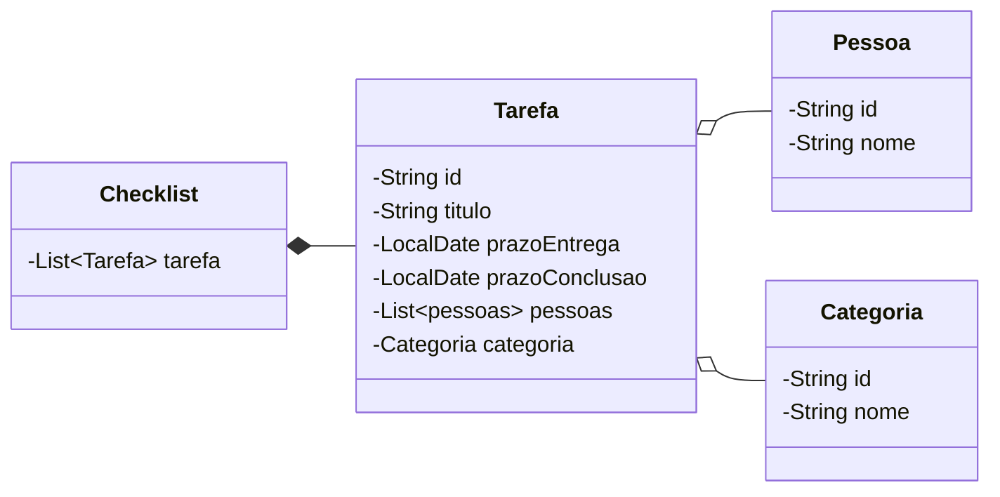

```mermaid

classDiagram
    direction LR


    class Tarefa {
        -String id
        -String titulo
        -LocalDate prazoEntrega
        -LocalDate prazoConclusao
        -List~pessoas~ pessoas
        -Categoria categoria
    }

    class Pessoa {
        -String id
        -String nome
    }

    class Categoria {
        -String id
        -String nome
    }

    class Checklist {
        -List~Tarefa~ tarefa
    }

    Checklist  *-- Tarefa
    Tarefa o-- Pessoa
    Tarefa o-- Categoria
    

```